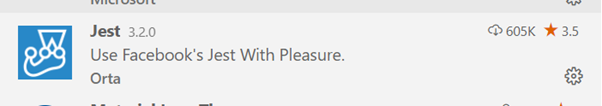
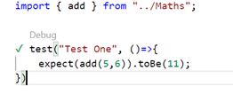

# TypeScript Development Environment Quick Start
The following instructions show how to setup a TypeScript Development Environment very quickly. Copying this folder gives you a ready made scratch environment for messing about in TypeScript

## Copy the template project
Take a copy of the template project [basic-dev-env](../examples/basic-dev-env/) and run the following command from the root directory

```
npm install
```

## Debug a source file
Open the sample file *src/index.ts* in Visual Studio code and add a breakoint. Now press F5 to start debugging. You can add other *.ts* files in the src folder and debug them in the same manner. The debugger will attach to currently open file. 

## Debug a test
The sample project contains an example test file in *src/tests/Maths.test.ts* In order to debug this test you will need to install the Jest pluging for visual studio code. 

**Jest Plugin**



Once installed you should see a small Debug icon above the method and you can attache breakpoints and debug the code

